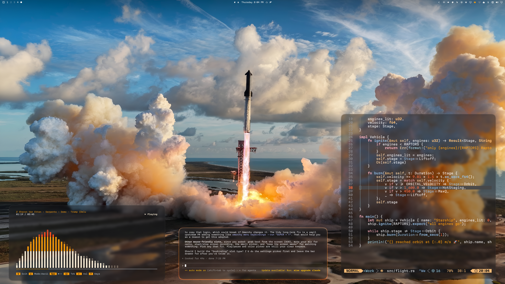
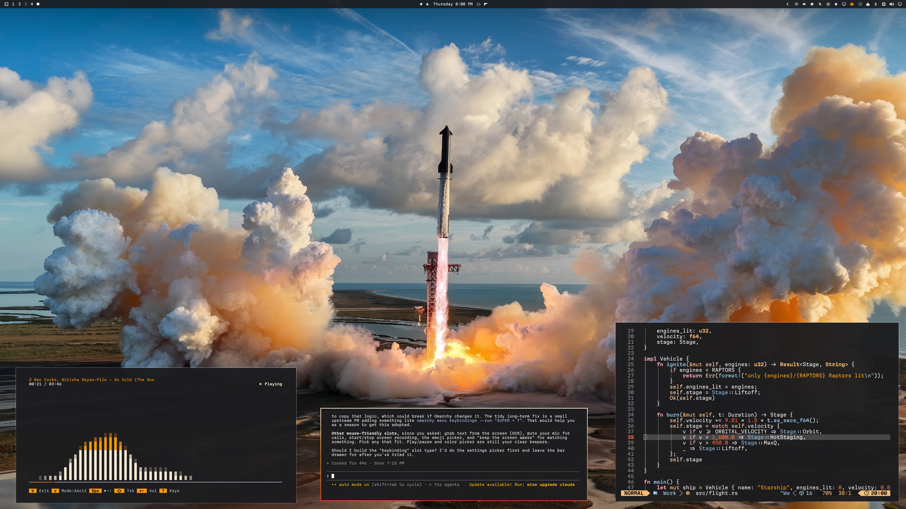
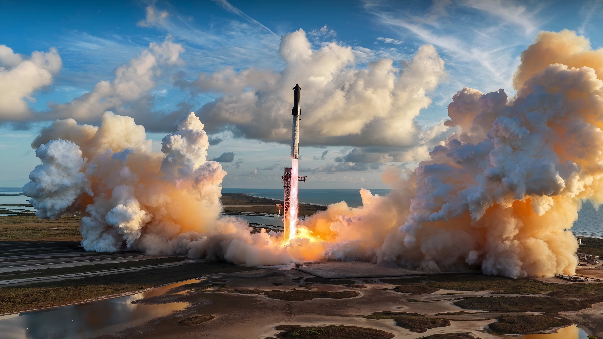
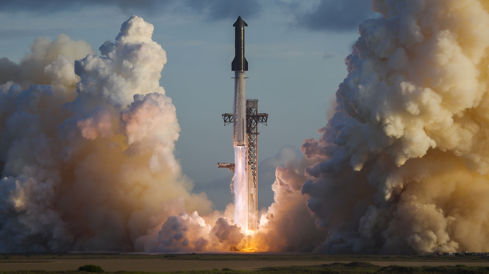
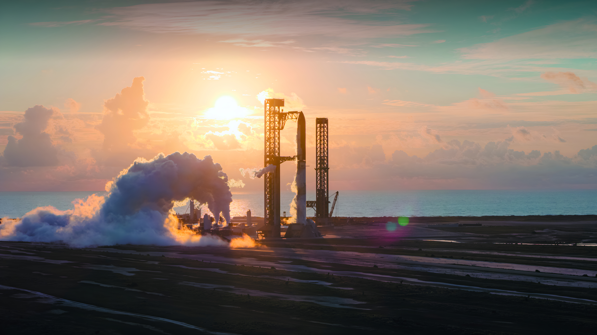

# Starship To Orbit

An Omarchy theme celebrating Starship's flight to orbit: the colours of the Raptor plume and the launch sky over 6K launch photographs, with optional frosted glass.



With the [full glass effect](#full-glass-effect-optional): the [cliamp](https://github.com/bjarneo/cliamp) music visualizer, Claude Code and Neovim in Ghostty.



As installed with `omarchy theme install`, without the glass.

## At a glance

**Included with the install command:**

- The palette: the Raptor plume (engine flame, amber, ember) and the launch sky (sky blue, ice blue) over white and grey text.
- Plume-edged windows, and a bar, launcher, menus, notifications and lock screen edged by the plume.
- The same colours in the terminal, Neovim and the About screen.
- btop with every graph drawn as the plume.
- GTK colours, and three launch backgrounds in 6K.

**Added by the optional [full glass effect](#full-glass-effect-optional)** (one extra step):

- Lightly frosted windows, with the launch showing through.
- A see-through, frosted bar and shell panels.
- Translucent terminals with fully opaque text.
- Squircle corners and a faint warm glow.

**Separate and optional:**

- [Ghostty as the default terminal](#full-glass-effect-optional), so terminals are frosted rather than clear.
- A [cliamp theme](#extras) that draws the music visualizer as the plume.

## Backgrounds

Three SpaceX launch photographs. All three are 6016 × 3384 (6K). Omarchy starts with the first; cycle through them with the background switcher (`Super + Ctrl + Space`) or `omarchy theme bg next`.

| | |
| --- | --- |
| [](backgrounds/1-starbase.jpg) | [](backgrounds/2-liftoff.jpg) |
| **Starbase.** Photo: SpaceX. The launch from above, over the pad and the Gulf. The top edge is gently shaded so a transparent bar keeps white text. | **Liftoff.** Photo: SpaceX. Starship clearing the tower at dusk between walls of exhaust. |
| [](backgrounds/3-morning-pad.jpg) | |
| **Morning pad.** Photo: SpaceX. The stack venting on the pad at sunrise, with the Gulf behind. The top edge is gently shaded so a transparent bar keeps white text. | |

The photographs were upscaled to 6K with Real-ESRGAN, which sharpens the detail already there rather than inventing new detail (see [third-party notices](THIRD_PARTY_NOTICES.md)).

## Install

```bash
omarchy theme install https://github.com/erikrjohansson/omarchy-starship-to-orbit-theme.git
```

Tested on Omarchy **4.0.4**.

### Full glass effect (optional)

Omarchy skips Lua and terminal configs from installed themes for safety, so the command above gives you the palette, the plume edges, the shell and the btop graphs, but not the frosted glass. To add the glass, read [`hyprland.lua`](hyprland.lua), the terminal configs and the `shell.*.toml` links to [`extras/glass`](extras/glass), then run:

```bash
git clone https://github.com/erikrjohansson/omarchy-starship-to-orbit-theme.git ~/.local/share/omarchy-starship-to-orbit-theme
rm -rf ~/.config/omarchy/themes/starship-to-orbit
ln -s ~/.local/share/omarchy-starship-to-orbit-theme ~/.config/omarchy/themes/starship-to-orbit
omarchy theme set starship-to-orbit
```

That adds:

- Lightly frosted windows: the launch stays recognisable behind them, only fine detail is softened.
- Terminals with a translucent background and fully opaque text; [Omawrite](https://github.com/erikrjohansson/omawrite) and [Flea](https://github.com/erikrjohansson/flea) turn to glass too. Everything else stays opaque.
- Large squircle corners and the faintest warm glow on the focused window.
- The same frosting on a see-through bar, launcher, menus, notifications, OSD and polkit dialogs, and a see-through lock screen. Installed themes drop these links, so without the glass the shell stays solid enough to read over any window.

Ghostty frosts the glass. Foot's translucent background is not blurred by Hyprland, so it stays clear glass; to use frosted glass everywhere, switch the default terminal:

```bash
omarchy default terminal ghostty
```

### Update

Without the full glass effect (installed with `omarchy theme install` only):

```bash
omarchy theme update
omarchy theme set starship-to-orbit
```

With the full glass effect, `omarchy theme update` skips your copy (it doesn't update symlinked themes), so pull it yourself:

```bash
git -C ~/.local/share/omarchy-starship-to-orbit-theme pull
omarchy theme set starship-to-orbit
```

Setting the theme again is what brings in new backgrounds and changes; it also resets the wallpaper to the first background.

## Extras

[`extras/cliamp/starship-to-orbit.toml`](extras/cliamp/starship-to-orbit.toml) is a matching theme for the [cliamp](https://github.com/bjarneo/cliamp) music player. Its visualizer is drawn as the plume: white-hot at the base, engine flame through the middle, red-orange at the tips.

```bash
mkdir -p ~/.config/cliamp/themes
cp ~/.config/omarchy/themes/starship-to-orbit/extras/cliamp/starship-to-orbit.toml ~/.config/cliamp/themes/
```

Then press `t` in cliamp and choose `starship-to-orbit`. cliamp keeps a theme you choose there when you change Omarchy themes. To go back to your terminal's colours, which follow the Omarchy theme, remove the `theme` line from `~/.config/cliamp/config.toml`.

## Customization

The colours live in `colors.toml`; Omarchy generates Neovim and the other apps from it. `shell.toml`, `btop.theme` and `gtk.css` carry copies, and so do the terminal configs, `hyprland.lua` and `extras/glass` used by the full glass effect; change them together, then run `omarchy theme set starship-to-orbit`.

The theme contains no application patches or install hooks.

## License

[MIT](LICENSE). Copyright (c) 2026 Erik Johansson.

The background images are not covered by the MIT license; see [third-party notices](THIRD_PARTY_NOTICES.md), which also records attribution for adapted upstream portions.
